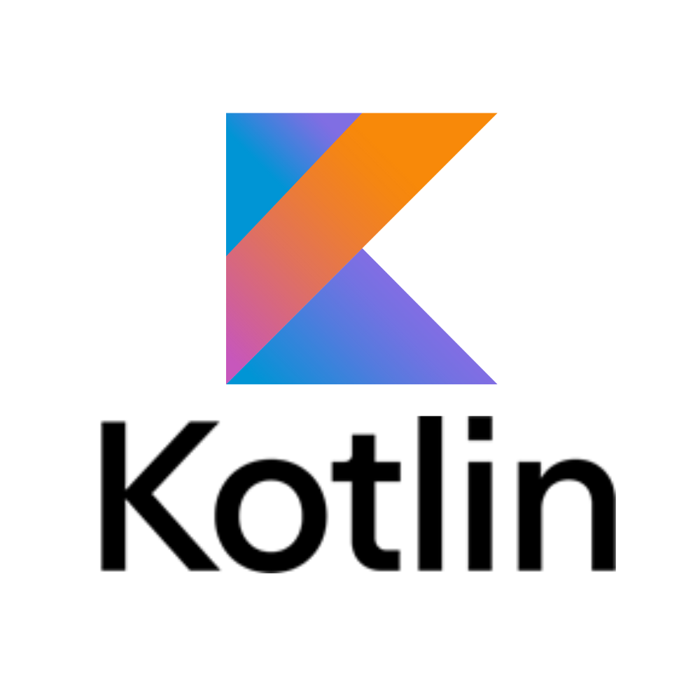

<link rel="stylesheet" href="Ishan.css">
<h1 align="center">Hi 👋, I'm Ishan walia</h1>
<h3 align="center">I am Btech 1Year student </h3>

<br>
<h1>Youtude & Instagram channel</h1>
<h4>Welcome </h4>
<table>
  <tr>
    <th><h6><a href="https://www.instagram.com/_coding._.club/profilecard/?igsh=MWEzNmo3dzh3djd1eQ==">Coding._.club</a></h6></th>
    <th><h6><a href="https://www.instagram.com/kotlin_project/profilecard/?igsh=a2k3cDY3cmVoc2N3">Kotlin coder</a></h6></th>
    <th><h6><a href="https://www.instagram.com/codingforpython/profilecard/?igsh=MXB0ZmptbWY4cHlxNw==">Codingforpython</a></h6></th>
    <th><h6><a href="https://www.instagram.com/css_coder_?igsh=MW9mZWVqdjVxNjFs">Css_coder</a></h6></th>
    <th><h6><a href="https://www.instagram.com/html_coder_?igsh=MWIxZ25xYnk4enEwaQ==">Html_coder</a></h6></th>
  </tr>
  <tr>
    <td></td>
    <td></td>
    <td></td>
    <td></td>
    <td></td>
    
  </tr>
  <br>

</table>

<p align="left">  </p>

<p align="left"> <a href="https://github.com/ryo-ma/github-profile-trophy"></a> </p>

- 👯 I’m looking to collaborate on **Mobile App Development    + Web design   +  Cybersecurity   **

- 💬 Ask me about **DevOps**

- 📫 How to reach me ** <a href="https://www.instagram.com/ishanwalia_/">Instagram**

- ⚡ Fun fact **I create Instagram videos, youtude etc...**
<table>
  <tr>
    <th>linkdin</th>
    <th>Instagram</th>
    <th id="l1">Youtude</th>
    <th>Telegram</th>
    <th>Hackerearth</th>
    <th>Whatapp</th>
    
  </tr>
  <tr>
    <td>
      </td>
      <td></td>
    <td>
      <td>
      <td>
      
       
  </tr>
</table>
<br>
-Eduction:
<ol type="1">
  <li>Schooling<ul type="disc"><li>St Francies Xavier's Convent School   12<sup>th</sup>&nbsp;86%</li></ul></li>
  <li>undergraduate<ul type="disc"><li>I am an undergraduate student in my first year of B.Tech  CSE at LPU(Lovely Professional University)</li></ul></li>
</ul>
<h3 align="left">Connect with me:</h3>
<p align="left">
<a href="https://codepen.io/ishan-coder" target="blank"></a>
<a href="https://www.linkedin.com/in/ishan-walia-734621324/" target="blank"></a>
<a href="https://instagram.com/_coding._.club" target="blank"></a>
<a href="https://www.youtube.com/c/https://youtube.com/@coding._.club." target="blank"></a>
<a href="https://www.hackerrank.com/https://www.hackerrank.com/profile/waliaishanipshi1" target="blank"></a>
<a href="https://auth.geeksforgeeks.org/user/https://www.geeksforgeeks.org/user/waliaisha3lxi/" target="blank"></a>
</p>
<h3 align="center">Andriod app developers</h3>

<h3 align="left">Languages and Tools:</h3>
<p align="left"> <a href="https://developer.android.com" target="_blank" rel="noreferrer">  </a> <a href="https://angular.io" target="_blank" rel="noreferrer">  </a> <a href="https://git-scm.com/" target="_blank" rel="noreferrer">  </a> <a href="https://www.w3.org/html/" target="_blank" rel="noreferrer">  </a> <a href="https://kotlinlang.org" target="_blank" rel="noreferrer">  </a> <a href="https://www.linux.org/" target="_blank" rel="noreferrer">  </a> <a href="https://www.mongodb.com/" target="_blank" rel="noreferrer">  </a> <a href="https://nodejs.org" target="_blank" rel="noreferrer">  </a> <a href="https://www.python.org" target="_blank" rel="noreferrer">  </a> </p>


<p></p>

<p>&nbsp;</p>

<p></p>

<br>
<br>
<h2> Hi, I'm Anshul aka rad1ant! </h2>

[](https://github.com/rad1antc0d3)

[](https://twitter.com/0xRad1ant)
[](https://www.linkedin.com/in/0xRad1ant/)
[](https://github.com/0xRad1ant) 


###  A little more about me...


- 👨🏽‍💻 I’m currently working on personal projects;
- 🌱 I’m currently learning for the CEH Practical;
- 💬 Ask me about anything, I am happy to help;
- ⚡️ I use ARCH btw;
- 📫 How to reach me: hi@x0r.xyz;

<br>
<br>

<p align="left"> 
  <a href="https://tryhackme.com/r/p/0xRad1ant">
    
  </a>
</p>


<br>
<br>

```javascript
const rad1ant = {
  code: {
    languages: ["Python", "JavaScript", "Shell Scripting", "PHP"],
    frameworks: ["React.js", "Node.js", "Express.js"],
  },
  tools: {
    security: ["Burp Suite", "Wireshark", "John the Ripper", "Nmap", "Metasploit"],
    virtualization: ["Docker", "KVM", "VMware"],
    cloud: ["AWS", "Azure", "Heroku"],
    others: ["Git", "rclone"],
  },
  architecture: {
    styles: ["microservices", "event-driven", "design system pattern"],
    security: ["secure web applications", "multi-factor authentication", "encryption"],
  },
  cybersecuritySkills: {
    areas: ["Pentesting", "Security Audits", "Networking", "API Vulnerability Discovery", "Cybersecurity Awareness"],
    methods: ["Vulnerability Assessment", "Threat Modeling", "Incident Response"],
  },
}

```

<h2>🚀 Some Tools I Use</h2>
<p align="left">
    
    
    
    
    
    
    
    
    
    
    
    
    
    
    
    
    
    
    
    
    
    
    
    
    
    
    
</p>


<br>

**🐱 My Wakatime Data** 

<!--START_SECTION:waka-->

```txt
Other        36 mins         ████████████░░░░░░░░░░░░░   48.05 %
YAML         11 mins         ███▓░░░░░░░░░░░░░░░░░░░░░   15.05 %
TypeScript   11 mins         ███▓░░░░░░░░░░░░░░░░░░░░░   15.00 %
Markdown     8 mins          ███░░░░░░░░░░░░░░░░░░░░░░   11.57 %
Text         4 mins          █▒░░░░░░░░░░░░░░░░░░░░░░░   05.67 %
```

<!--END_SECTION:waka-->

<br>

<p align="center">
  
</p>
